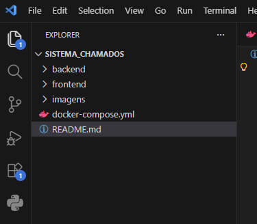
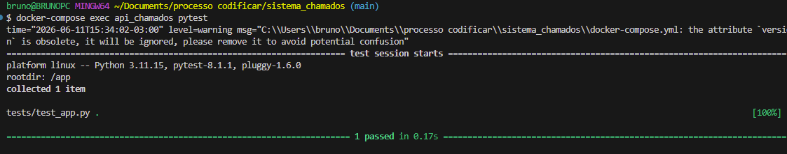
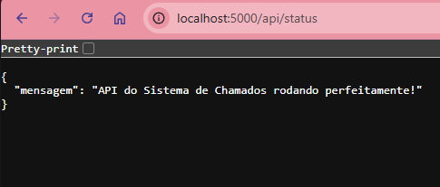

# Sistema de Controle de Chamados Internos 

Este repositório contém a minha solução para o **Desafio Técnico Full Stack (Nível Básico)** para o processo seletivo do time de engenharia de software da **Codificar**.

##  Sobre o Projeto

O objetivo deste projeto é construir a primeira versão de um sistema para organizar e gerenciar pedidos de suporte interno de uma empresa. A aplicação visa resolver o problema de descentralização das solicitações (feitas por WhatsApp, e-mail, etc.) e equilibrar a carga de trabalho da equipe de suporte através de uma distribuição inteligente.

##  Justificativa de Arquitetura e Escolhas Tecnológicas (Item 1.2)

O escopo do desafio enfatiza a importância da **produtividade em times pequenos**, **redução de atrito** e **facilidade de execução local** por qualquer membro do time. Pensei em uma solução com as seguintes tecnologias:

* **Backend: Python com Flask**
  * **Por quê?** Python oferece uma sintaxe limpa e alta produtividade. O Flask, sendo um microframework, é leve, direto ao ponto e perfeito para construir APIs RESTful rápidas e eficientes sem a sobrecarga de ferramentas que não seriam utilizadas neste escopo inicial.
* **Frontend: Vue.js**
  * **Por quê?** O Vue.js permite a criação de interfaces reativas de forma muito intuitiva. Sua excelente componentização ajuda a manter o código limpo (DRY) e facilita a manutenção, alinhando-se com a necessidade de reduzir o atrito no desenvolvimento do lado do cliente.
* **Banco de Dados: SQLite**
  * **Por quê?** Para garantir que a aplicação seja executável localmente sem dor de cabeça. O SQLite dispensa a instalação e configuração de servidores de banco de dados pesados, rodando a partir de um único arquivo local.
* **Infraestrutura: Docker e Docker Compose**
  * **Por quê?** Atendendo diretamente ao requisito **6.1**, o uso de containers garante que qualquer pessoa da equipe da Codificar possa rodar o projeto com apenas um comando, sem se preocupar com versões de pacotes, instalação de linguagens ou conflitos de ambiente.

## Diário de Desenvolvimento

Para demonstrar a evolução e o funcionamento do sistema, documentei as etapas de desenvolvimento e as telas da aplicação:

### Estrutura de pastas:


### Como executar o projeto localmente 

Pensando na facilidade de execução por qualquer membro da equipe, o projeto foi totalmente conteinerizado.

### Pré-requisitos
* [Docker](https://www.docker.com/) , [Rancher desktop](https://rancherdesktop.io/) ou algum outro **orquestrador de conteiner** instalado e rodando em sua máquina.

### Configuração do Backend e Testes Iniciais

Nesta etapa, o ambiente básico do backend foi estruturado utilizando o Flask. Visando a qualidade e estabilidade do código, também foi configurada a infraestrutura de testes automatizados com o `pytest` dentro do container Docker.

####  Execução dos Testes Automatizados
Foi criado um teste automatizado básico para validar a rota de status da API. Ao executar os testes de dentro do container com o comando: 
```Bash
  docker-compose exec api_chamados pytest
```
   
  A suite respondeu com sucesso:



####  Validação da API no Navegador
Com o container Docker em execução, a rota de status da API (`/api/status`) foi testada diretamente no navegador, confirmando que o "motor" do nosso sistema está respondendo corretamente em formato JSON:



## Regras de Negócio e Decisões 

### Definição de Chamados "Em Aberto"
Para o algoritmo de **Distribuição Automática**, foi necessário definir o que constitui um chamado "em aberto" para calcular a carga de trabalho de cada responsável.

**Decisão:** Apenas chamados com os status `aberto` e `em andamento` são contabilizados na carga de trabalho.
Porque no dia a dia de uma equipe de suporte, um chamado `resolvido` (aguardando validação do usuário) ou `fechado` não exige mais esforço ativo do técnico. Contabilizar esses status finalizados faria com que bons profissionais que resolvem muitos chamados fossem punidos recebendo menos chamados novos, desequilibrando a produtividade real da equipe.

## Passos para execução
1. Clone este repositório:
   ```bash
   git clone https://github.com/SirMusashi/sistema_chamados.git
   ```

2. Acesse a pasta do projeto:
   ```bash
   cd sistema_chamados
   ```
3. Suba os containers da aplicação:
   ```bash
   docker-compose up --build
   ```

4. A API estará disponível no endereço: http://localhost:5000 
---
Desenvolvido por Bruno Duarte para o processo seletivo da Codificar.
